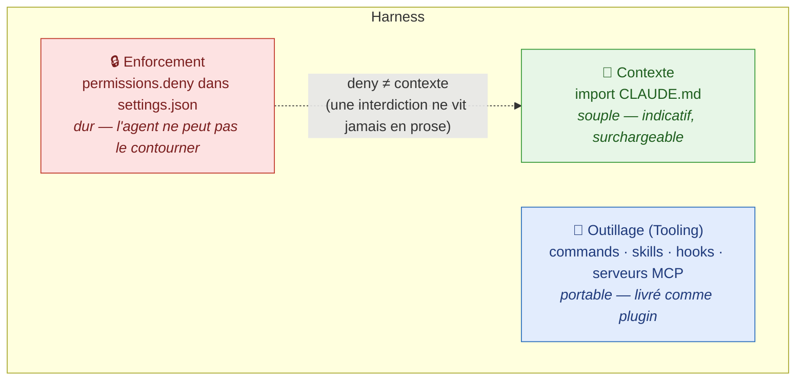
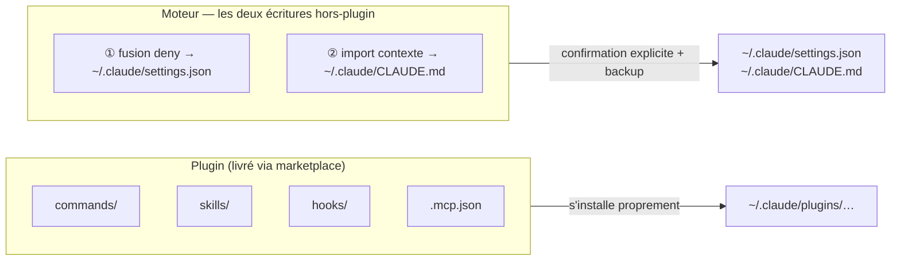
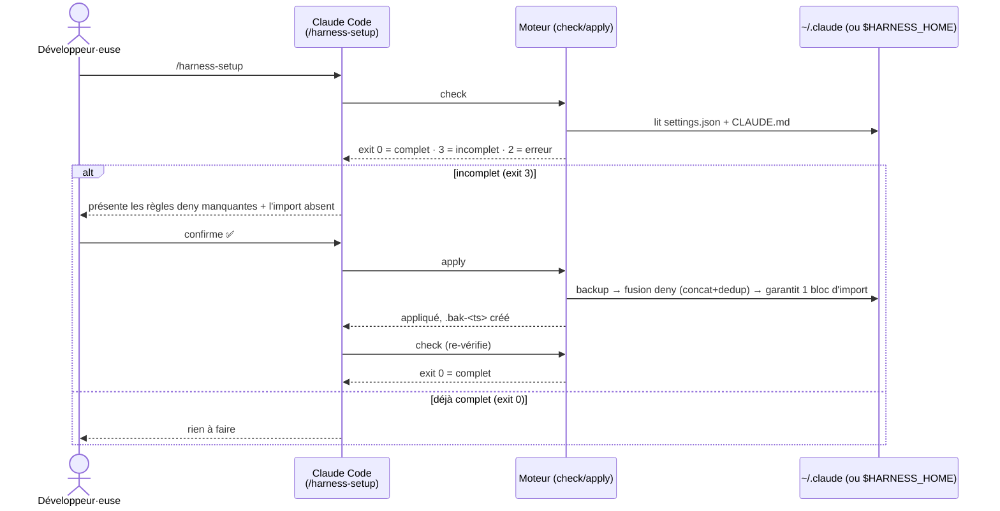
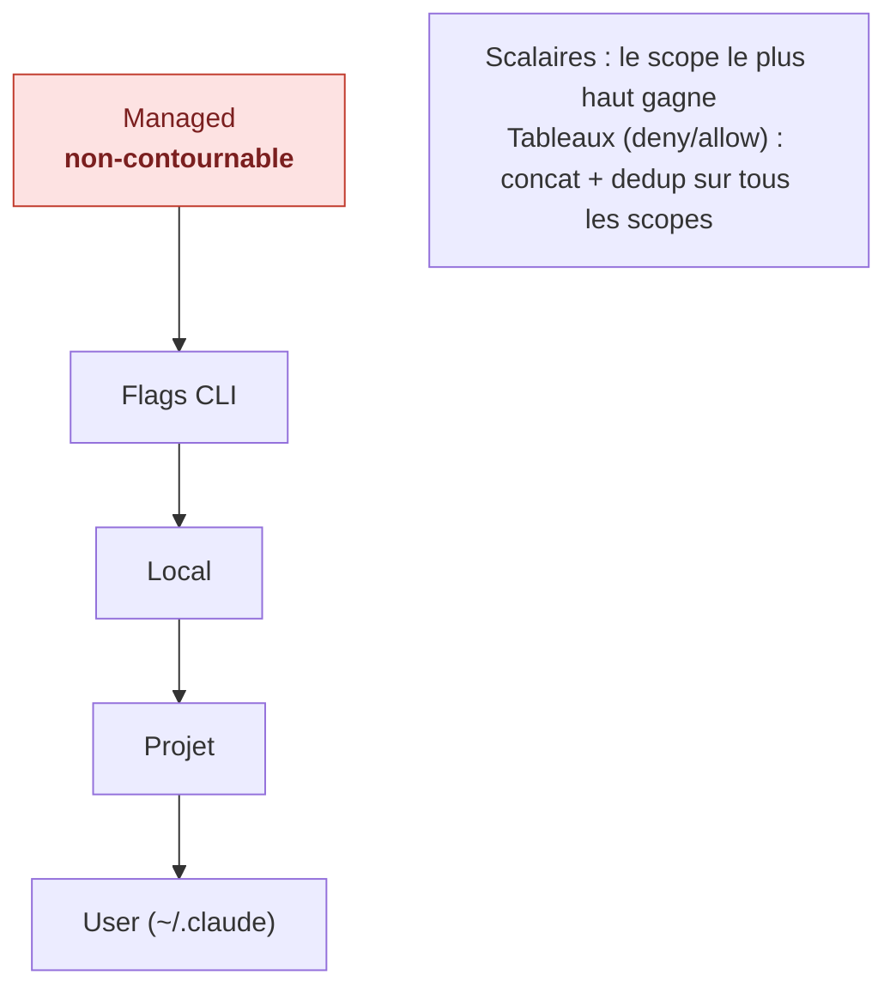
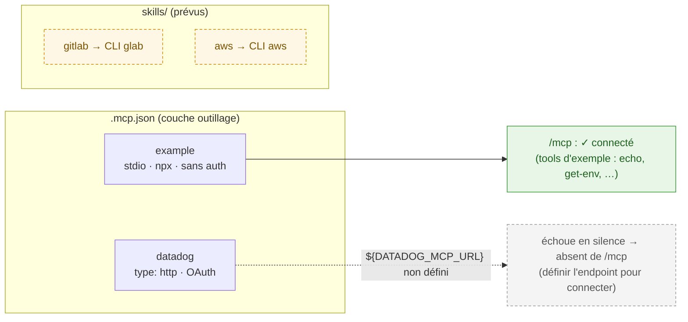
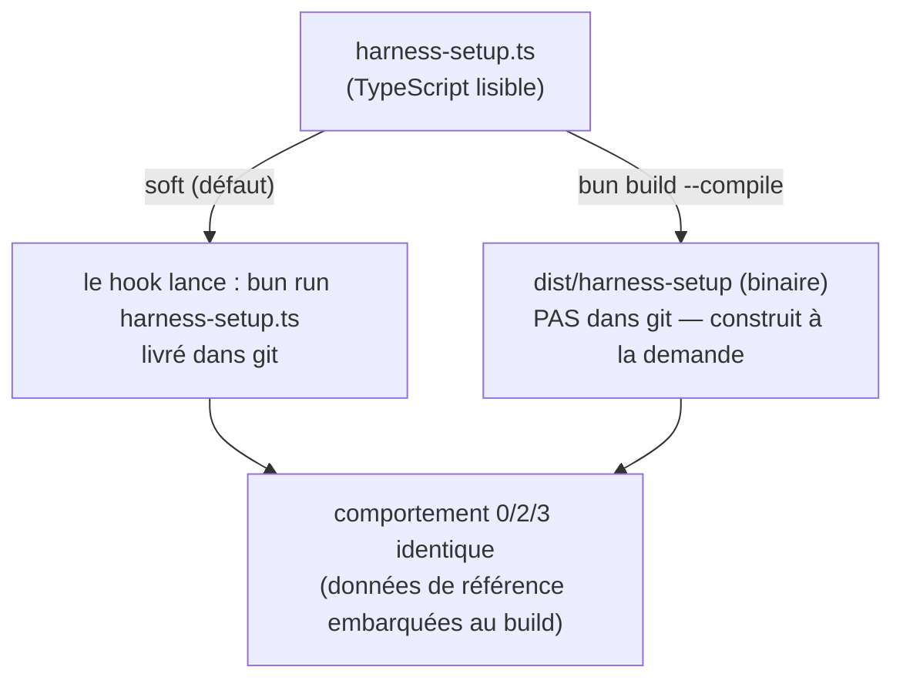

# Comment ça marche

Version française de [`how-it-works.md`](how-it-works.md).

Une visite guidée du harness : les trois couches, le flux `check → apply`, la
précédence des scopes, le knob soft/hardened, et la couche outillage (serveurs
MCP + skills adossés à des CLI). Les termes en **gras** sont définis dans
[`CONTEXT.md`](../CONTEXT.md).

---

## 1. Les trois couches

Un harness n'est pas un seul fichier. Il s'étend sur trois couches aux
**propriétés de confiance différentes** — cette séparation est tout l'enjeu du
design.



> **Invariant clé — deny ≠ contexte.** Une interdiction dure appartient à la deny
> list (ou à un hook `PreToolUse`), jamais à `CLAUDE.md`. `CLAUDE.md` est une
> guidance dont on peut détourner l'agent par l'argumentation.

Ce dépôt livre les trois : les règles deny (`reference/deny.json`), l'outillage
du plugin (commands, skill, hook, **et des serveurs MCP** — §5), et le gabarit de
contexte (`reference/CONTEXT.md`).

---

## 2. Ce qu'un plugin peut et ne peut pas écrire

Un **plugin** Claude Code distribue l'outillage proprement. Mais deux des trois
couches ne sont **pas** des composants de plugin — le format plugin ne sait pas
les exprimer. Le moteur effectue exactement ces deux écritures, avec ton accord.



C'est la raison d'être du moteur : la couche plugin est nécessaire mais **pas
suffisante** pour configurer un harness complet.

---

## 3. Le flux `check → apply`

Le moteur est déterministe et sans dépendances. Il expose deux sous-commandes et
communique ses résultats par **codes de sortie**. L'agent n'écrit jamais sans une
confirmation explicite entre `check` et `apply`.



**Contrat de codes de sortie :** `0` complet · `2` erreur · `3` incomplet. Même
contrat en mode soft et hardened (§4). Les backups (`<fichier>.bak-<timestamp>`)
sont écrits avant toute modification, donc l'état précédent est toujours
récupérable.

---

## 4. Scope & précédence

La configuration est superposée sur plusieurs scopes. Les valeurs **scalaires**
se résolvent par précédence (le scope supérieur l'emporte) ; les valeurs
**tableau** comme la deny list sont **fusionnées** (concaténées et dédupliquées)
entre scopes — jamais écrasées.



Le moteur écrit dans le scope **User** (`~/.claude`). Seul le scope **managed**
est réellement non-contournable par le propriétaire de la machine — contexte
important pour le caveat d'honnêteté ci-dessous.

---

## 5. Outillage : serveurs MCP et CLI

La couche outillage n'est pas que des serveurs MCP — c'est la capacité portable
la mieux adaptée au besoin. Pour une stack DevOps typique, on fait un choix
délibéré :

| Cible       | Mécanisme                            | Pourquoi                                                                |
| ----------- | ------------------------------------ | ----------------------------------------------------------------------- |
| **Datadog** | **serveur MCP** (officiel, OAuth)    | Pas de vraie CLI pour interroger metrics/logs/traces — le MCP convient. |
| **GitLab**  | **CLI** `glab` → skill _(plus tard)_ | `glab` couvre déjà MR/pipelines/issues ; on l'emballe dans un skill.    |
| **AWS**     | **CLI** `aws` → skill _(plus tard)_  | La CLI `aws` est la surface canonique ; un skill la cadre pour l'agent. |

> Règle de pouce : prends un **serveur MCP** quand il n'y a pas de bonne CLI (ou
> que la donnée est structurée et orientée requête, comme l'observabilité) ;
> prends un **skill au-dessus d'une CLI** quand un outil en ligne de commande
> mature existe déjà. Ajouter un serveur MCP inutile, c'est juste plus de surface
> à authentifier et maintenir.



Le [`.mcp.json`](../plugins/jrobic-cc-harness-setup-example/.mcp.json) du plugin
déclare **deux** serveurs MCP — un qui connecte tout seul (pour la démo) et un
exemple réaliste qui demande une config par utilisateur.

### `example` — un MCP vivant, sans identifiant

Le serveur `example` est le **serveur de référence MCP** officiel
(`@modelcontextprotocol/server-everything`), lancé via `npx` en stdio, **sans
auth**. Il connecte immédiatement, donc `/mcp` montre un MCP fonctionnel et ses
tools d'exemple (`echo`, `get-env`, `get-sum`, …). C'est un **placeholder pour
illustrer la couche outillage** — remplace-le par tes vrais serveurs.

> Astuce démo live : préchauffe-le une fois pour que la 1re connexion ne soit pas
> un téléchargement npm : `npx -y @modelcontextprotocol/server-everything`
> (Ctrl-C une fois démarré).

### MCP Datadog (exemple réaliste, à configurer)

Le plugin déclare aussi le **serveur MCP Datadog officiel** — transport HTTP,
**OAuth au runtime**, donc aucune clé d'API n'est jamais commitée. L'endpoint est
**spécifique à l'organisation/au site** ; ce dépôt le laisse en
`${DATADOG_MCP_URL}`. **Variable non définie, Claude Code ne peut pas résoudre
l'URL vide et le serveur échoue en silence — il n'apparaît _pas_ dans `/mcp`.**
C'est attendu : c'est un placeholder à configurer, pas un bug.

**Chemin recommandé — le plugin officiel de Datadog** (remplit l'endpoint, lance
l'OAuth) :

```text
/plugin install datadog@claude-plugins-official
/ddsetup        # choisis ton site, complète l'OAuth
```

**Chemin manuel** — définis l'endpoint, l'OAuth se déclenche à la 1re
utilisation :

```bash
export DATADOG_MCP_URL=<ton-endpoint-mcp-datadog>   # depuis /ddsetup ou la doc Datadog
claude            # /mcp → datadog → autorise via OAuth
```

Sites supportés : US1/US3/US5, EU (`datadoghq.eu`), AP1/AP2. **GovCloud n'est pas
supporté.** Voir la [doc de setup MCP Datadog](https://docs.datadoghq.com/fr/mcp_server/setup/?tab=claudecode).

### GitLab & AWS — CLI + skill (prévus, pas encore construits)

`glab` et la CLI `aws` font déjà le travail, donc ces cibles reçoivent des
**skills qui emballent la CLI** plutôt que des serveurs MCP. Pas implémentés à
cette phase — suivis dans [`PROGRESS.md`](specs/harness-setup-example/PROGRESS.md).
Une fois construits, ils vivront sous
`plugins/jrobic-cc-harness-setup-example/skills/` et appelleront la CLI que le
développeur a déjà authentifiée (`glab auth status`, `aws sso login`).

---

## 6. Soft vs hardened

Le moteur se livre en deux modes, choisis par un knob de build.



> **Caveat d'honnêteté — hardened n'est _pas_ de l'enforcement.** Compiler ne fait
> que durcir l'**outillage** contre les éditions accidentelles ou triviales de la
> source. Le vrai enforcement, c'est la liste `permissions.deny` dans
> `settings.json`, et seul le scope **managed** est réellement non-contournable.
> « Compilé » ne doit jamais être vendu comme « inviolable ». Voir
> [ADR-0003](adr/0003-soft-vs-hardened-compile-knob.md).

---

## Voir aussi

- [`how-it-works.md`](how-it-works.md) — version anglaise (source)
- [`CONTEXT.md`](../CONTEXT.md) — glossaire du domaine
- [`docs/adr/`](adr/) — architecture decision records
- [`docs/infographic-brief.md`](infographic-brief.md) — brief de l'infographie d'onboarding (pour Claude Design)
- [`README.md`](../README.md) — chemins d'installation et démarrage rapide
