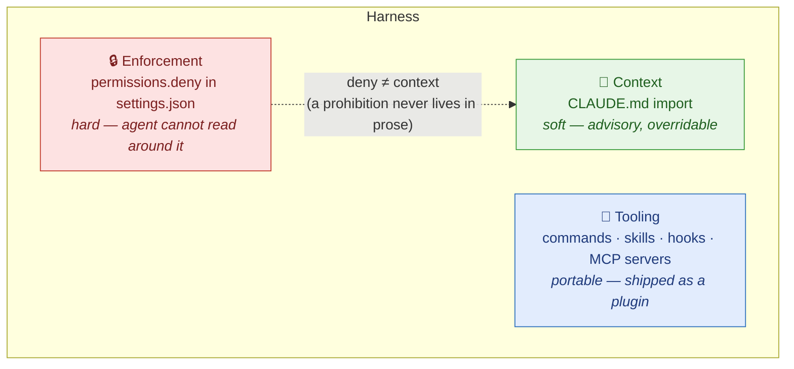
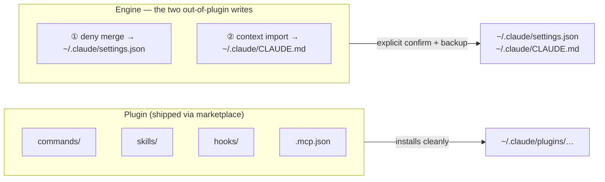
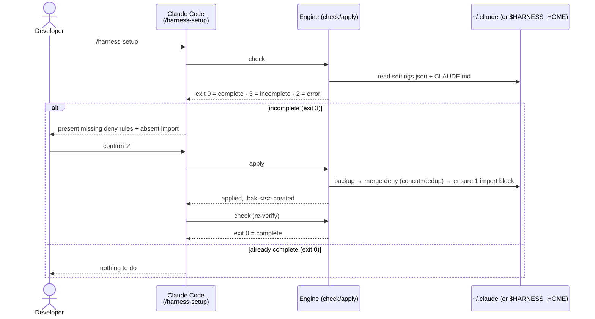
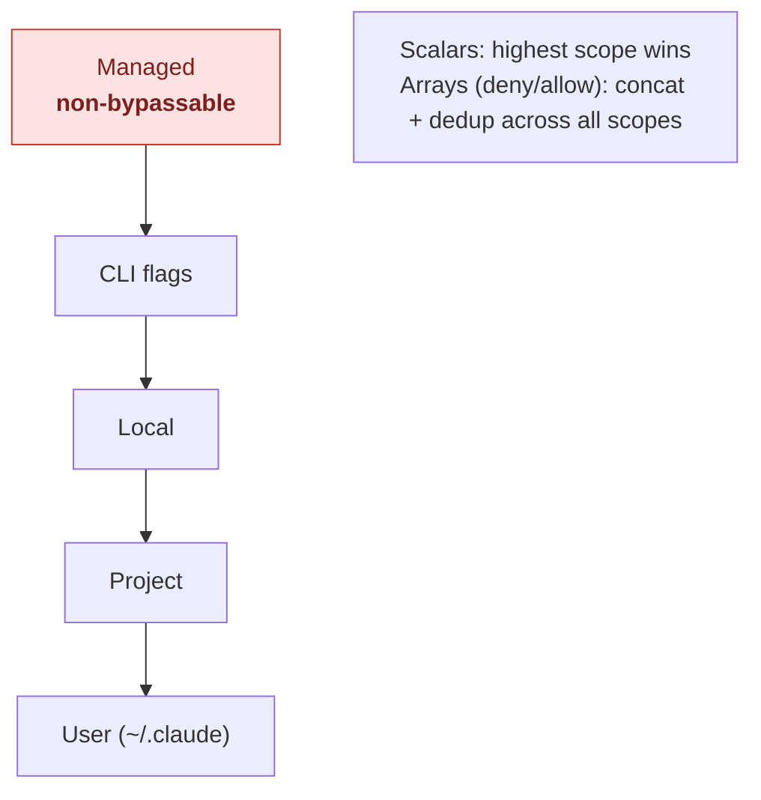
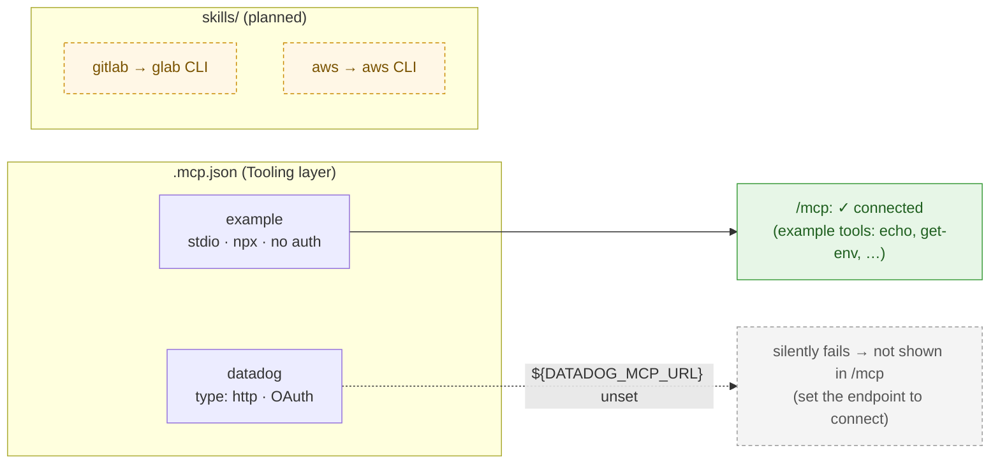
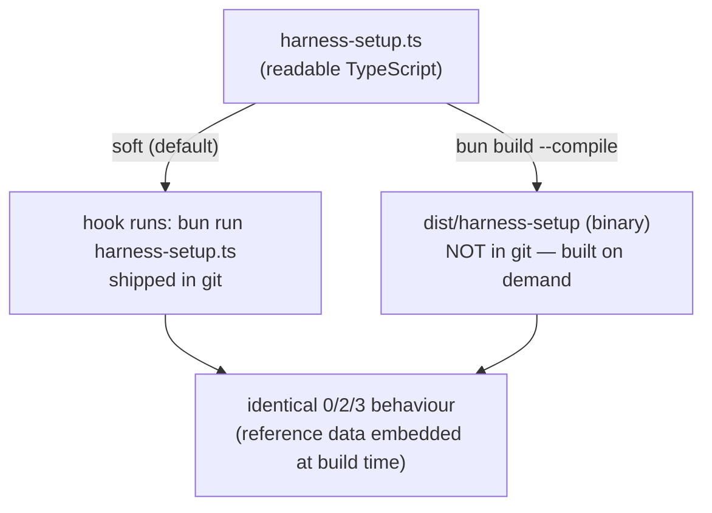

# How it works

🇫🇷 Version française : [`how-it-works.fr.md`](how-it-works.fr.md).

A visual walk-through of the harness: the three layers, the `check → apply`
flow, scope precedence, the soft/hardened knob, and the tooling layer (MCP
servers + CLI-backed skills). Terms in **bold** are defined in
[`CONTEXT.md`](../CONTEXT.md).

---

## 1. The three layers

A harness is not one file. It spans three layers with **different trust
properties** — that separation is the whole point of the design.



> **Key invariant — deny ≠ context.** A hard prohibition belongs in the deny list
> (or a `PreToolUse` hook), never in `CLAUDE.md`. `CLAUDE.md` is guidance the
> agent can be argued out of.

This repository ships all three: the deny rules (`reference/deny.json`), the
plugin tooling (commands, skill, hook, **and MCP servers** — §5), and the
context template (`reference/CONTEXT.md`).

---

## 2. What a plugin can and cannot write

A Claude Code **plugin** distributes tooling cleanly. But two of the three layers
are **not** plugin components — a plugin format cannot express them. The engine
performs exactly those two writes, with your consent.



That is why the engine exists at all: the plugin layer is necessary but **not
sufficient** to set up a full harness.

---

## 3. The `check → apply` flow

The engine is deterministic and dependency-free. It exposes two subcommands and
communicates results through **exit codes**. The agent never writes without an
explicit confirmation between `check` and `apply`.



**Exit-code contract:** `0` complete · `2` error · `3` incomplete. Same contract
in soft and hardened mode (§4). Backups (`<file>.bak-<timestamp>`) are written
before any modification, so the previous state is always recoverable.

---

## 4. Scope & precedence

Configuration is layered across scopes. **Scalar** values resolve by precedence
(higher overrides lower); **array** values like the deny list are **merged**
(concatenated and de-duplicated) across scopes — never overwritten.



The engine writes into the **User** scope (`~/.claude`). Only the **managed**
scope is truly non-bypassable by whoever owns the machine — important context for
the honesty caveat below.

---

## 5. Tooling: MCP servers and CLIs

The Tooling layer is not only MCP servers — it's whatever portable capability
fits the job. For a typical DevOps stack we make a deliberate split:

| Target      | Mechanism                        | Why                                                                   |
| ----------- | -------------------------------- | --------------------------------------------------------------------- |
| **Datadog** | **MCP server** (official, OAuth) | No first-class CLI for querying metrics/logs/traces — MCP fits.       |
| **GitLab**  | **CLI** `glab` → skill _(later)_ | `glab` already covers MRs/pipelines/issues; wrap it in a skill.       |
| **AWS**     | **CLI** `aws` → skill _(later)_  | The `aws` CLI is the canonical surface; a skill scopes it for agents. |

> Rule of thumb: reach for an **MCP server** when there is no good CLI (or the
> data is structured and query-shaped, like observability); reach for a **skill
> over a CLI** when a mature command-line tool already exists. Adding an MCP
> server you don't need is just more surface to authenticate and maintain.



The plugin's [`.mcp.json`](../plugins/jrobic-cc-harness-setup-example/.mcp.json)
declares **two** MCP servers — one that connects out of the box (for the demo)
and one realistic example that needs per-user setup.

### `example` — a live MCP, no credentials

The `example` server is the official MCP **reference server**
(`@modelcontextprotocol/server-everything`), run via `npx` over stdio with **no
auth**. It connects immediately, so `/mcp` visibly shows a working MCP and its
example tools (`echo`, `get-env`, `get-sum`, …). It is a **placeholder to
demonstrate the tooling layer** — swap it for your real servers.

> Live-demo tip: pre-warm it once so the first connect isn't an npm download:
> `npx -y @modelcontextprotocol/server-everything` (Ctrl-C after it starts).

### `datadog` — a realistic example (needs setup)

The plugin also declares the **official Datadog MCP server** — HTTP transport,
**OAuth at runtime**, so no API key is ever committed. The endpoint is
**org/site-specific**; this repo leaves it as `${DATADOG_MCP_URL}`. **With the
variable unset, Claude Code cannot resolve the empty URL and the server silently
fails — it does _not_ appear in `/mcp`.** That is expected: it is a needs-setup
placeholder, not a bug.

**Recommended path — Datadog's own plugin** (auto-fills the endpoint, runs OAuth):

```text
/plugin install datadog@claude-plugins-official
/ddsetup        # pick your site, complete OAuth
```

**Manual path** — set the endpoint, then OAuth runs on first use:

```bash
export DATADOG_MCP_URL=<your-datadog-mcp-endpoint>   # from /ddsetup or Datadog docs
claude            # /mcp → datadog → authorise via OAuth
```

Supported sites: US1/US3/US5, EU (`datadoghq.eu`), AP1/AP2. **GovCloud is not
supported.** See the [Datadog MCP setup docs](https://docs.datadoghq.com/mcp_server/setup/?tab=claudecode).

### GitLab & AWS — CLI + skill (planned, not built yet)

`glab` and the `aws` CLI already do the job, so these get **skills wrapping the
CLI** rather than MCP servers. Not implemented in this phase — tracked in
[`PROGRESS.md`](specs/harness-setup-example/PROGRESS.md). When built they live
under `plugins/jrobic-cc-harness-setup-example/skills/` and call the CLI the
developer already has authenticated (`glab auth status`, `aws sso login`).

---

## 6. Soft vs hardened

The engine ships in two modes, selected by a build knob.



> **Honesty caveat — hardened is _not_ enforcement.** Compiling only hardens the
> **tooling** against accidental or trivial edits to the source. Real enforcement
> is the `permissions.deny` list in `settings.json`, and only the **managed**
> scope is truly non-bypassable. "Compiled" must never be sold as "tamper-proof".
> See [ADR-0003](adr/0003-soft-vs-hardened-compile-knob.md).

---

## See also

- [`CONTEXT.md`](../CONTEXT.md) — domain glossary
- [`docs/adr/`](adr/) — architecture decision records
- [`docs/infographic-brief.md`](infographic-brief.md) — onboarding infographic brief (for Claude Design)
- [`README.md`](../README.md) — install paths and quick start
