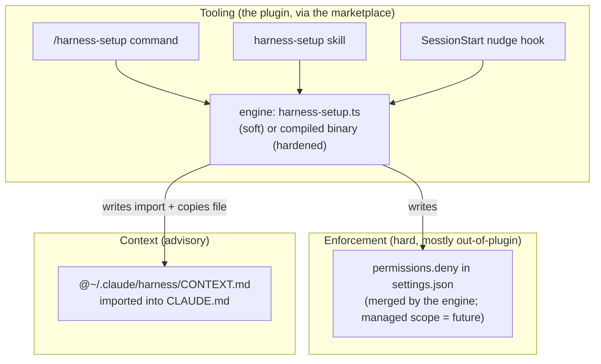
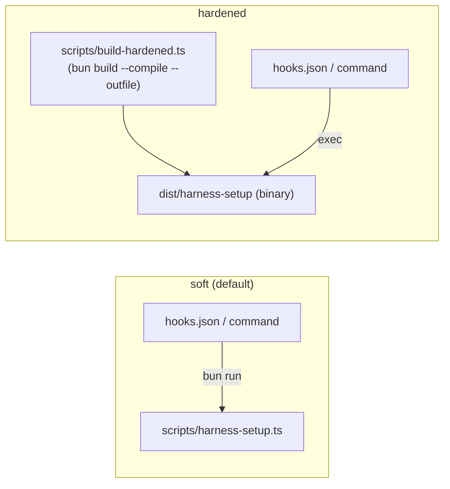
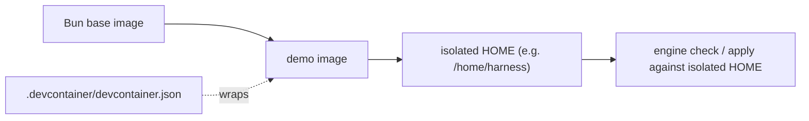

# Design — harness-setup-example

Boundary-first design for the Phase 1 OSS skeleton. The file plan below is the
unit of work for the BUILD phase: each leaf is small enough to be one (or part of
one) task in `tasks.md`.

References: ADR-0001 (repo = marketplace + plugin), ADR-0002 (Bun runtime),
ADR-0003 (soft vs hardened knob), ADR-0004 (generic public/private install).
Vocabulary: [`/CONTEXT.md`](../../../CONTEXT.md).

---

## 1. The three layers, mapped to artifacts



The engine is the only component that performs the **out-of-plugin writes**. The
plugin format carries the tooling; the deny list and the context import are
written into the user's home by the engine, with consent.

## 2. Target repository file plan (final tree)

This is the complete intended layout. `(opt)` marks optional/Phase-1-stretch
items; everything else is in the Phase 1 scope.

```
cc-harness-setup-example/
├── README.md                                  # OSS readme (EN): what/why, install (public+private), demo, honesty caveats
├── CONTEXT.md                                 # domain glossary (already written)
├── LICENSE                                    # OSS license
├── package.json                               # name, scripts (test, build:hardened, engine:check/apply), Bun engines
├── bunfig.toml                          (opt) # Bun config if needed (test root, etc.)
├── .gitignore                                 # ignore dist/, *.bak-*, node_modules/
├── .editorconfig                        (opt)
├── dprint.json                                # formatter config (per stack)
├── .oxlintrc.json                             # linter config (per stack)
│
├── .claude-plugin/
│   └── marketplace.json                       # advertises the single plugin (generic owner)
│
├── .claude/
│   └── settings.json                          # extraKnownMarketplaces -> this repo (clone & go)
│
├── plugins/
│   └── jrobic-cc-harness-setup-example/
│       ├── .claude-plugin/
│       │   └── plugin.json                     # generic author handle
│       ├── commands/
│       │   └── harness-setup.md                # /harness-setup orchestration (EN, confirm-before-write)
│       ├── skills/
│       │   └── harness-setup/
│       │       └── SKILL.md                    # ambient entry point (EN)
│       ├── hooks/
│       │   └── hooks.json                       # SessionStart nudge (mode-aware invocation)
│       ├── scripts/
│       │   └── harness-setup.ts                 # THE ENGINE (Bun TS, zero-dep, check/apply)
│       ├── reference/
│       │   ├── deny.json                        # generic deny rules (source of truth)
│       │   └── CONTEXT.md                       # generic team context, copied into the user's home
│       └── .mcp.json                            # {} placeholder, documented Phase 2
│
├── scripts/
│   ├── build-hardened.ts                        # bun build --compile -> dist/ binary (hardened mode)
│   └── set-mode.ts                        (opt) # flips hooks/command between soft/hardened invocation
│
├── tests/
│   ├── harness-setup.check.test.ts              # exit codes 0/2/3
│   ├── harness-setup.apply.test.ts              # deny merge, context copy, import block
│   ├── harness-setup.idempotence.test.ts        # second apply is a no-op; single import/no dup deny
│   ├── harness-setup.backup.test.ts             # .bak created on change; none when unchanged
│   └── helpers/
│       └── tmp-home.ts                           # builds an isolated HOME, seeds settings/CLAUDE.md
│
├── docker/
│   ├── Dockerfile                               # Bun base image, isolated HOME, runs check/apply
│   └── README.md                          (opt) # how to build/run the demo
├── .devcontainer/
│   └── devcontainer.json                        # optional wrapper over docker/Dockerfile
│
├── .github/
│   └── workflows/
│       └── ci.yml                               # lint + bun test
│
├── docs/
│   ├── adr/                                      # 0001..0004 + README (written)
│   └── specs/harness-setup-example/             # requirements/design/tasks/PROGRESS (this spec)
│
├── examples/
│   └── clone-and-go/                      (opt) # a tiny repo skeleton showing extraKnownMarketplaces
│       └── .claude/settings.json
└── PRESENTATION.md                         (opt) # talk track: 3 layers, deny≠context, traps
```

> Port note: the source POC's `harness-setup.mjs` (Node ESM) becomes
> `harness-setup.ts` (Bun TS). The logic is the same; the changes are: TS types,
> environment-driven home resolution (R7), English messages, and the
> mode-aware hook/command invocation.

## 3. Engine contract

`plugins/jrobic-cc-harness-setup-example/scripts/harness-setup.ts`

### CLI

```
harness-setup <check|apply>
  check   audit only; never writes
  apply   merge deny, copy context, ensure import block; backs up before writing
  (no arg defaults to check; unknown mode -> exit 2)
```

### Exit codes (stable contract — tests assert these)

| Code | Meaning |
|------|---------|
| `0`  | `check`: configuration complete · `apply`: applied successfully |
| `2`  | usage error (unknown mode) or invalid JSON in target `settings.json` |
| `3`  | `check`: configuration incomplete (missing deny rule and/or import) |

### Path resolution

- **Reference dir** (read-only source of truth): resolved relative to the engine
  file (`<engine>/../reference/`), holding `deny.json` and `CONTEXT.md`.
- **Target home** (write target): resolved from the environment to allow
  isolation (R7). Resolution order:
  1. an explicit isolation override env var (e.g. `HARNESS_HOME`) if set;
  2. otherwise the standard home directory.
  Derived targets:
  - `<home>/.claude/settings.json`
  - `<home>/.claude/CLAUDE.md`
  - `<home>/.claude/harness/CONTEXT.md`

> The env override is the single seam that makes tests and the Docker demo safe:
> point `HARNESS_HOME` at a temp/container dir and the engine never touches the
> operator's real `~/.claude`.

### Internal shape (functions, not a framework)

Pure helpers, no dependencies, Bun-native `node:fs`/`node:os`/`node:path`:

- `resolveHome(env)` → home dir (override-aware).
- `readJson(path)` → parsed object or `{}` (missing/empty); throws-to-exit-2 on
  invalid JSON.
- `readText(path)` → string or `""`.
- `backup(path)` → copies to `<path>.bak-<ISO-timestamp>` if the file exists.
- `computeMissingDeny(refDeny, currentDeny)` → array of rules to add.
- `ensureImportBlock(claudeMd)` → new content with exactly one managed block.
- `report(missing, importPresent)` → prints audit.
- `main(mode, env)` → orchestrates; returns exit code.

`main` returns the exit code so tests can call it in-process; the shebang wrapper
calls `process.exit(main(...))`.

## 4. Write schemas (exactly what changes on disk)

### settings.json — deny merge (R2.1, R4)

```jsonc
// before
{ "permissions": { "deny": ["Read(./.env)"] }, "model": "…keep…" }
// after apply (concat + dedup; nothing else touched)
{ "permissions": { "deny": ["Read(./.env)", "Read(~/.ssh/**)", "…"] }, "model": "…keep…" }
```

### CLAUDE.md — managed import block (R2.3, R3, R5)

```md
…the user's existing content, untouched…

<!-- BEGIN harness (managed — do not edit) -->
@~/.claude/harness/CONTEXT.md
<!-- END harness -->
```

Idempotence rule: locate the block by markers and replace it in place; if the
import line already exists outside the markers, do not add a second one.

### context file copy (R2.2, R5.3)

`reference/CONTEXT.md` → `<home>/.claude/harness/CONTEXT.md` (overwrite; this file
is engine-managed and not meant to be hand-edited).

## 5. Apply flow

```mermaid
sequenceDiagram
  actor Dev
  participant Cmd as /harness-setup
  participant Eng as engine
  participant FS as ~/.claude (resolved home)

  Dev->>Cmd: run /harness-setup
  Cmd->>Eng: check
  Eng->>FS: read settings.json, CLAUDE.md (read-only)
  Eng-->>Cmd: missing deny + import status (exit 0|3)
  alt complete (exit 0)
    Cmd-->>Dev: already configured, stop
  else incomplete (exit 3)
    Cmd-->>Dev: present missing rules + missing import
    Dev->>Cmd: confirm
    Cmd->>Eng: apply
    Eng->>FS: backup, merge deny, copy context, ensure import
    Eng-->>Cmd: summary (exit 0)
    Cmd-->>Dev: applied; .bak-… created; nothing else changed
  end
```

## 6. Soft vs hardened strategy (ADR-0003)

Two invocation paths for the same engine. The seam is *how hooks and the command
reference the engine*.



- **soft (default):** hook command is `bun run "${CLAUDE_PLUGIN_ROOT}/scripts/harness-setup.ts" check …`.
  The command markdown uses the filesystem fallback because
  `${CLAUDE_PLUGIN_ROOT}` does **not** expand in command markdown (it is reliable
  in hook JSON). Fallback: search `~/.claude/plugins` for `harness-setup.ts`.
- **hardened:** `scripts/build-hardened.ts` runs `bun build --compile --outfile dist/harness-setup`
  (cross-target via `--target bun-<os>-<arch>` when shipping for other platforms).
  Hook/command then exec the binary instead of `bun run`.
- A small `set-mode.ts` (optional) flips the invocation strings in `hooks.json`
  and the command between the two modes so the switch is a single command, not a
  manual edit.

**Honesty caveat (must be in README + here):** the hardened binary is *not*
enforcement. It only resists accidental/trivial edits to the tooling. Real
enforcement is `permissions.deny`, and only the managed scope is non-bypassable.
Never describe the binary as tamper-proof. (ADR-0003.)

### `${CLAUDE_PLUGIN_ROOT}` trap (pedagogical)

| Surface | Expands? | Strategy |
|---------|----------|----------|
| hook JSON (`hooks.json`) | yes | use `${CLAUDE_PLUGIN_ROOT}` directly |
| command markdown | **no** | filesystem fallback: find the engine under `~/.claude/plugins` |

## 7. Docker / devcontainer demo (R12)



- `docker/Dockerfile`: Bun base image; copy the repo; set an isolated HOME (or set
  `HARNESS_HOME`) so `check`/`apply` operate on a throwaway dir; default entrypoint
  runs the engine demo. The operator's real `~/.claude` is never mounted.
- `.devcontainer/devcontainer.json`: thin wrapper that builds from
  `docker/Dockerfile` — no duplicated build logic (R12.2).
- Running the Claude Code CLI inside the container is **conditional** on the CLI
  being available there; the docs state this and do not assume it (R12.3).

## 8. Tests (R13) — points to cover

All tests use `tests/helpers/tmp-home.ts` to build an isolated HOME and point the
engine at it via the env override; they never touch the real `~/.claude`.

| Test file | Asserts |
|-----------|---------|
| `check.test.ts` | exit `0` when complete; exit `3` when a deny rule or import is missing; exit `2` on invalid `settings.json` |
| `apply.test.ts` | deny concat + dedup; pre-existing unrelated deny rules preserved; context file copied; one managed import block created |
| `idempotence.test.ts` | second `apply` leaves no duplicate deny rules and exactly one import; `check` after `apply` exits `0` |
| `backup.test.ts` | `.bak-<timestamp>` created when a file changes; **no** backup when nothing changes (R4.3/R6.2) |

`main(mode, env)` returning an exit code (section 3) lets tests run in-process and
inspect the resolved isolated home.

## 9. CI (R14)

`.github/workflows/ci.yml`: on push / PR → set up Bun → lint (oxlint) + format
check (dprint) → `bun test`. Fails the job on any lint or test failure.

## 10. De-internalisation map (applied during BUILD)

Carried from the brief; each item becomes a check in `tasks.md`:

| Source artifact | Internal content to remove | Generic replacement |
|-----------------|----------------------------|---------------------|
| `plugin.json` | author "internal org" | generic handle (`jrobic`) |
| `marketplace.json` | internal owner/email | generic owner |
| `reference/CONTEXT.md` | "internal marketplace", "security/IT validation" | generic example team context (EN) |
| `README.md` | internal git host / host CLI / in-house CA section | generic public + private HTTPS (EN), ADR-0004 |
| `BRIEF.md` | entire file (internal) | **not shipped** |
| commands / skill / hooks / deny.json / engine | French strings, Node `.mjs` | English, Bun `.ts` |

A final grep gate (tasks.md) verifies no internal reference remains before the
repo is publishable.
